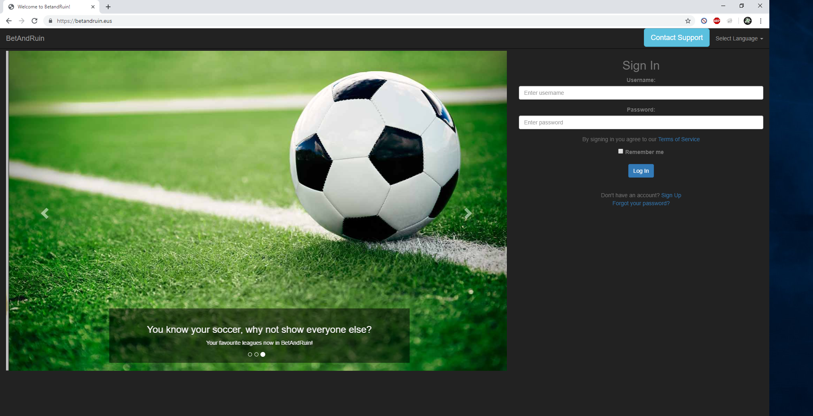
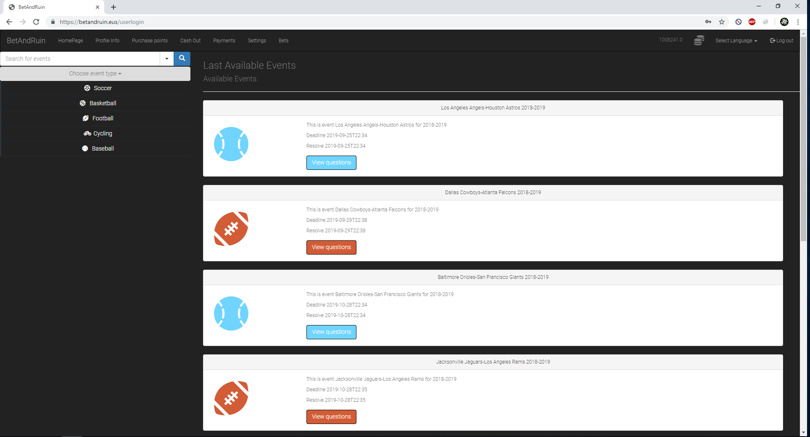
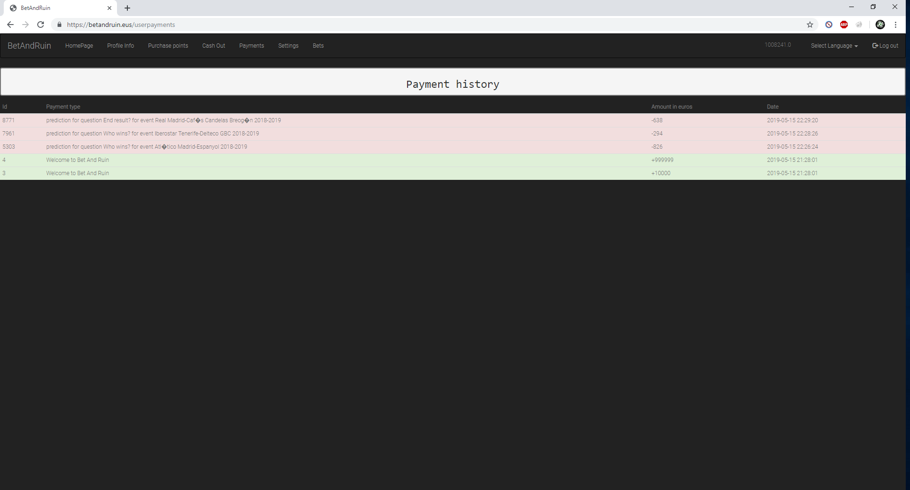
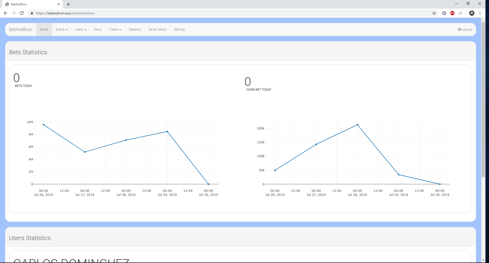
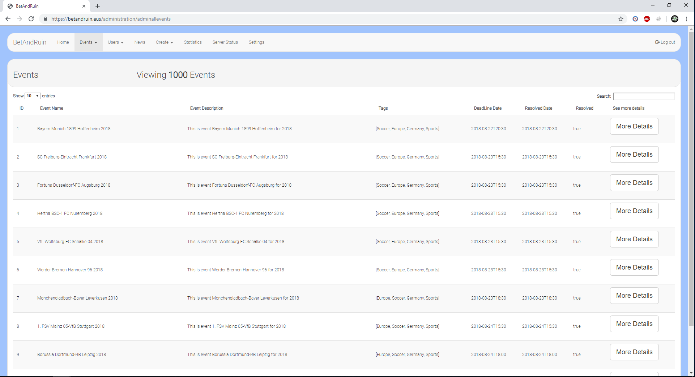
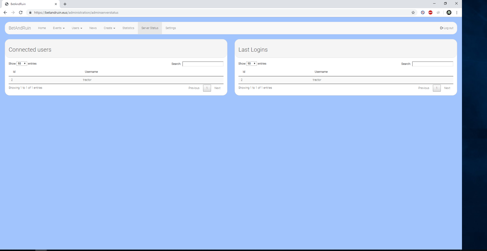
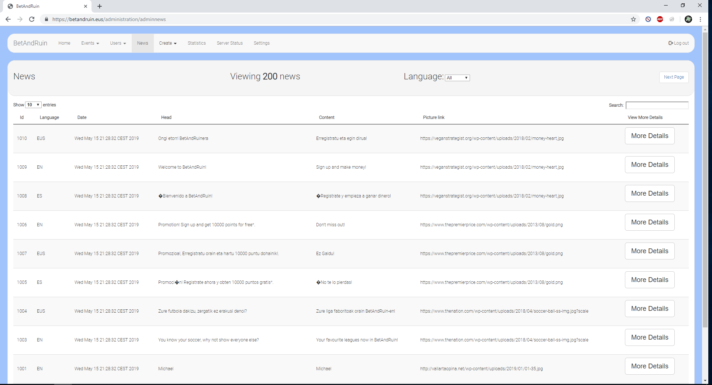
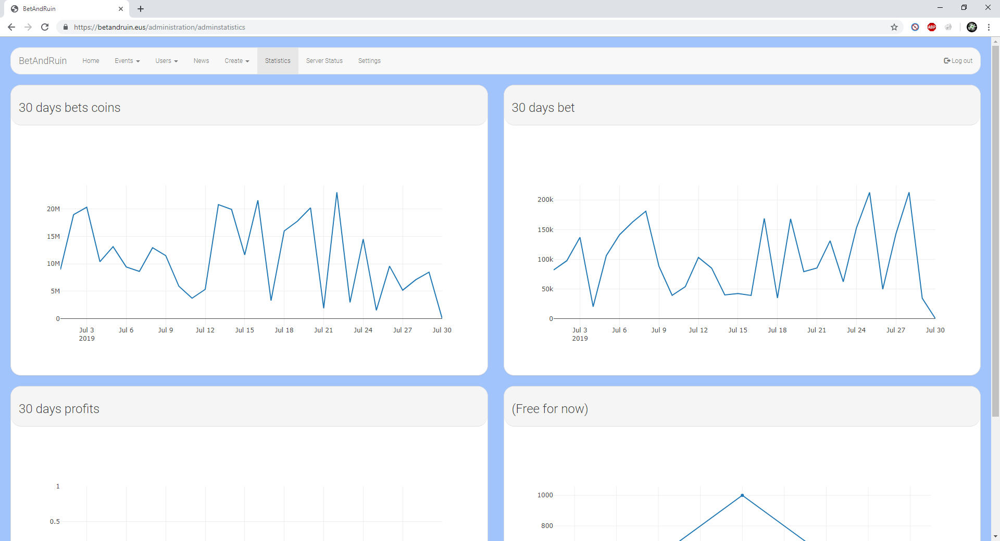

# BetAndRuin
Gambling webpage with a three-layer architecture and client-server based. Languages used: JAVA for the backend and HTML, CSS, JS and JQuery for the frontend

# How to run the project

1.- Execute: src/webServerV3/SimpleHTTPServer

2.- Open your favourite web browser and search for:

  - "localhost" for the costumer GUI
  - "localhost/administration" for the administration GUI

3.- Have fun
 
 # Testing

For testing:

  - Username: tractor
  - Password: Patata

# Pictures

# help

If any help needed: carlosdbmac@gmail.com
